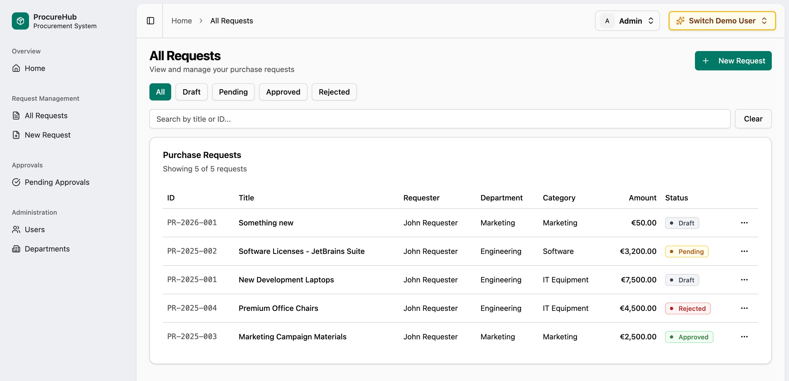
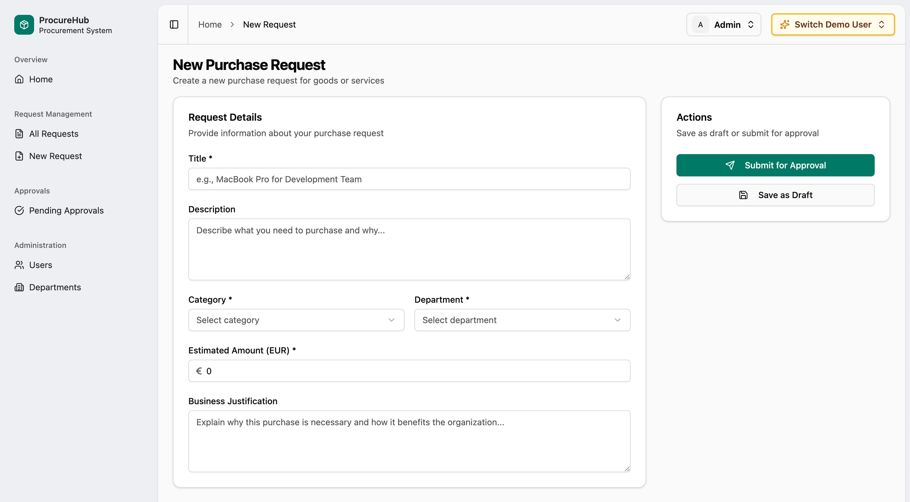

# ProcureHub

A full-stack example procurement and purchase approvals system. Demonstrates real-world patterns, testing, deployment, and Infrastructure As Code using Terraform.

* C# / .Net API and domain
* React frontend
* Postgres DB

## Screenshots





---

## Highlights

- **End-to-End Type Safety**: OpenAPI spec auto-generates a TypeScript client. Types flow from C# API to React components
- **Vertical Slice Architecture**: Features grouped cohesively on both backend and frontend
- **Role-Based Access Control**: UI adapts per role. API enforces authorization at every endpoint
- **Comprehensive Testing**: Quick integration tests for cross-cutting concerns, and detailed tests for domain logic
- **Infrastructure as Code**: Terraform modules for Azure deployment (Container Apps, Postgres, Key Vault)
- **AI-Assisted Development**: `AGENTS.md` files built up during development and pointing to best practice examples.

----

## Quick Links

### Purchase Request Application Slice

Domain

* EF Core Entity model & mapping: [PurchaseRequest](ProcureHub/Models/PurchaseRequest.cs)
* Domain handlers: [ProcureHub/Features/PurchaseRequests](ProcureHub/Features/PurchaseRequests)
  * Command handler: [CreatePurchaseRequest.cs](ProcureHub/Features/PurchaseRequests/CreatePurchaseRequest.cs)
  * Query handler: [QueryPurchaseRequests.cs](ProcureHub/Features/PurchaseRequests/QueryPurchaseRequests.cs)

API

* Endpoint mapping: [PurchaseRequests/Endpoints.cs](ProcureHub.WebApi/Features/PurchaseRequests/Endpoints.cs)
  * Domain `IRequestHandler` injected into endpoints
  * Full OpenAPI configuration to enable typesafe client generation

Frontend

* Features folder: [src/features/purchase-requests](ProcureHub.WebApp/src/features/purchase-requests)
* Routes: [src/routes/(auth)/_app-layout/requests](ProcureHub.WebApp/src/routes/(auth)/_app-layout/requests)

Tests

* Integration tests: [PurchaseRequestTests.cs](ProcureHub.WebApi.Tests/Features/PurchaseRequestTests.cs)
  * Note there are 2 test classes in file - one for mostly stateless, cross-cutting concerns (database only reset per class instance), and one for detailed domain testing using Arrange-Act-Assert approach (DB reset per test).

### Agents.md

- [AGENTS.md](AGENTS.md)
- [ProcureHub/AGENTS.md](ProcureHub/AGENTS.md)
- [ProcureHub.WebApp/AGENTS.md](ProcureHub.WebApp/AGENTS.md)
- [ProcureHub.WebApi/Features/AGENTS.md](ProcureHub.WebApi/Features/AGENTS.md)

---

## Architecture

```
┌─────────────────────────────────────────────────────────────────────────┐
│                           React SPA (TanStack)                          │
│         TanStack Router · TanStack Query · shadcn/ui · Tailwind         │
└───────────────────────────────┬─────────────────────────────────────────┘
                                │ openapi-react-query (generated client)
                                ▼
┌─────────────────────────────────────────────────────────────────────────┐
│                      ASP.NET Core Minimal API                           │
│           OpenAPI 3.1 · FluentValidation · ASP.NET Identity             │
└───────────────────────────────┬─────────────────────────────────────────┘
                                │ EF Core
                                ▼
┌─────────────────────────────────────────────────────────────────────────┐
│                            PostgreSQL                                   │
└─────────────────────────────────────────────────────────────────────────┘
```

---

## Tech Stack

### Backend (.NET 10)
- **ASP.NET Core Minimal APIs** with OpenAPI 3.1 documentation
- **EF Core** with PostgreSQL, code-first migrations, clean entity configuration
- **ASP.NET Identity** with custom application User entity
- **FluentValidation** with automatic decorator-based validation ([ValidationRequestHandlerDecorator](ProcureHub/Infrastructure/ValidationRequestHandlerDecorator.cs))
- **Problem Details** for consistent error responses

### Frontend (React + TypeScript)
- **TanStack Router** for type-safe routing
- **Typesafe API client** based on TanStack Query, via [openapi-react-query](https://openapi-ts.dev/openapi-react-query/)
- **shadcn/ui** component library with Tailwind CSS
- **Feature-based structure** mirroring backend organization

---

## Notable Patterns & Techniques

### Type-Safe API Client Generation

The API exposes an OpenAPI spec that generates a fully typed TypeScript client, using the [openapi-react-query](https://openapi-ts.dev/openapi-react-query/) library. The generated client wraps [TanStack Query](https://tanstack.com/query/latest).


```bash
npm run generate:api-schema  # Regenerates client from OpenAPI spec
```

### Transport-Agnostic Domain Logic

Domain request handlers return a [Result&lt;T&gt;](ProcureHub/Common/Result.cs) type, keeping domain logic decoupled from HTTP concerns. API maps to HTTP error using [ToProblemDetails](ProcureHub.WebApi/Helpers/ResultExtensions.cs) extension method.

```csharp
// Handler returns domain result
public async Task<Result<string>> HandleAsync(Request request, CancellationToken token)
{
    // ... domain logic
    return Result.Success(userId);
    // or: return Result.Failure<string>(UserErrors.EmailTaken);
}

// Endpoint maps to HTTP response
result.Match(
    userId => Results.Created($"/users/{userId}", new { userId }),
    error => error.ToProblemDetails()  // Converts Error → RFC 9457 Problem Details
);
```

### Request handlers and decorators

Simple [AddRequestHandlers](ProcureHub/Infrastructure/RequestHandlerExtensions.cs) extension method in the domain project:
- Registers all `IRequestHandler` implementations
- Adds a `ValidationRequestHandlerDecorator` which runs any FluentValidation validators before invoking the handlers

(For more complex needs, I would consider using MediatR)


### OpenAPI Schema Customization
Custom logic was needed to ensure nested response types generate unique schema names. See: [CreateOpenApiSchemaReferenceId](ProcureHub.WebApi/Program.cs#L258).

Example: Transforms `DataResponse<GetUserById.Response>` to `"DataResponseOfGetUserByIdResponse"`.


### Identity API Fixes
The standard ASP.Net `MapIdentityApi` required two fixes:
- Added missing 401 response documentation for `/login` endpoint (to ensure generated client had correct types). I also added that to the [Github issue](https://github.com/dotnet/aspnetcore/issues/52424#issuecomment-3677914753)
- Added `/logout` endpoint (not included by default)

See: [ConfigureIdentityApiEndpoints](ProcureHub.WebApi/Program.cs#L202)


### AI Agents

This project is structured for effective collaboration with AI coding agents:

- **`AGENTS.md` files** at project root and in key directories provide context and conventions
- **Context documents** in `.context/` describe the domain and use cases
- **Good patterns** established mostly manually first, then agents pointed to those


### Integration Testing

I use two different test classes for each feature area:
- One uses an xUnit `IClassFixture` to only reset the database once per class fixture (good for testing stateless, cross-cutting concerns like authentication and basic validation)
- The other resets the database before each test (used to test the core domain logic using Arrange-Act-Assert approach)

Example: See the `UserTestsWithSharedDb` and `UserTests` classes in [UserTests.cs](ProcureHub.WebApi.Tests/Features/UserTests.cs)

I also use xUnit theory tests to enforce that all endpoints have correct authentication, authorization, and basic DTO validation tests. Snippets shown below

```csharp
    public static TheoryData<EndpointInfo> GetAllUserEndpoints() => new()
    {
        new EndpointInfo("/users", "POST", "CreateUser"),
        new EndpointInfo("/users", "GET", "QueryUsers"),
        // ... every endpoint listed
    };

    [Theory]
    [MemberData(nameof(GetAllUserEndpoints))]
    public async Task All_user_endpoints_require_authentication(EndpointInfo endpoint)
    {
        // Note: Not logging in as anyone initially

        var path = endpoint.Path.Replace("{id}", "test-id");
        var request = new HttpRequestMessage(new HttpMethod(endpoint.Method), path);

        var resp = await HttpClient.SendAsync(request);
        Assert.Equal(HttpStatusCode.Unauthorized, resp.StatusCode);
    }

    [Theory]
    [MemberData(nameof(GetAllUserEndpoints))]
    public void All_user_endpoints_have_validation_tests(EndpointInfo endpoint)
    {
        // Verify test method exists using reflection
        var testMethod = GetType().GetMethod($"Test_{endpoint.Name}_validation");
        Assert.NotNull(testMethod);
    }

    [Fact]
    public async Task Test_CreateUser_validation()
    {
        // Test validation on the CreateUser endpoint
        ... 
    }

    [Fact]
    public async Task Test_QueryUsers_validation()
    {
        // Test validation on the QueryUsers endpoint
        ...
    }
```


---

## Deployment

### Infrastructure As Code

- Terraform modules in [`/infra`](infra/) for Azure resources
- Uses separate `staging` and `production` environments

### CI/CD
- **GitHub Actions** workflows for build, test, and deploy
- API containerized with Docker, pushed to GitHub Container Registry
- Frontend deployed to Azure Static Web Apps

---

## Running Locally

### Prerequisites
- .NET 10 SDK
- Node.js 20+
- Docker & Docker Compose

### Start databases
```bash
docker compose up -d
```

### Run API
```bash
cd ProcureHub.WebApi
dotnet run
```

### Run frontend
```bash
cd ProcureHub.WebApp
npm install
npm run dev
```

### Run tests
```bash
dotnet test ProcureHub.sln
```
